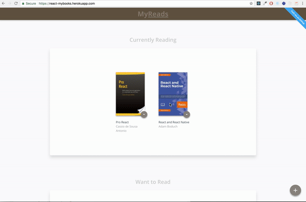

<br />

<h1 align="center">MyReads :books:</h1>
<div align="center"> MyReads is a bookshelf app that allows users to select and categorize books they have read, are currently reading, or want to read. Users can also search for books and add books to their bookshelf. The project is build using React and data is persisted by the [backend server](https://reactnd-books-api.udacity.com).</div>

<br />

<div align="center">

  <a href="https://circleci.com/gh/romarioraffington/react-mybooks">
    
  </a>

  <a href="https://coveralls.io/github/romarioraffington/react-mybooks">
    
  </a>

  <br />

  View the live app [here](https://react-mybooks.herokuapp.com) :bowtie: !
  
  <br />

  [](https://react-mybooks.herokuapp.com)

  <br />

</div>

## Getting Started

```shell
$ git clone https://github.com/romarioraffington/react-myreads.git
$ npm install
$ npm start
```

## Running Tests

```shell
$ npm test
```

## Running Coverage

```shell
$ npm run coverage
```

## Building the Project

```shell
$ npm run build
```

## Important
The backend API uses a fixed set of cached search results and is limited to a particular set of search terms, which can be found in [SEARCH_TERMS.md](SEARCH_TERMS.md). That list of terms are the _only_ terms that will work with the backend, so don't be surprised if your searches for Basket Weaving or Bubble Wrap don't come back with any results. 


## Contributing
Feel free to submit a pull requests! For specifics on how to contribute to this project, check out the  [contributing file](CONTRIBUTING.md).

## License
My Reads is released under the [MIT License](LICENSE).